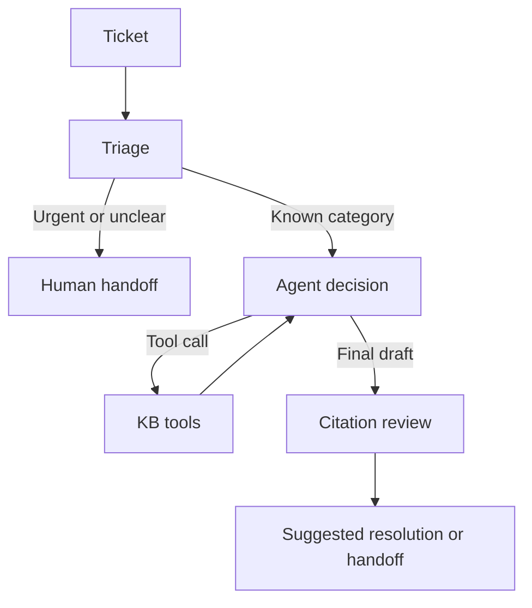

# LangGraph IT ticket triage and KB resolution demo

A standalone Python example for an IT team workshop. The graph classifies a ticket, uses two knowledge-base tools, and drafts a cited resolution. Urgent, unclear, or unsupported results go to a human queue. It does **not** alter tickets, accounts, or devices.

## Architecture



`StateGraph` holds the ticket, triage decision, messages, and outcome. `ToolNode` executes `search_kb` and `read_article`. The agent sees the tool result and decides whether to call another tool or finish. The final review requires citations to articles actually read. The graph caps tool results at four. This code follows the [LangGraph Graph API quickstart](https://docs.langchain.com/oss/python/langgraph/quickstart) and supports three LLM providers for live mode: [OpenRouter](https://reference.langchain.com/python/langchain-openrouter/langchain_openrouter), [Groq](https://docs.langchain.com/oss/python/integrations/chat/groq), and [OpenAI](https://docs.langchain.com/oss/python/integrations/chat/openai).

## Setup

Python 3.11 or newer:

```bash
python -m venv .venv
source .venv/bin/activate           # Windows: .venv\Scripts\activate
pip install -r requirements.txt
```

Or with [uv](https://docs.astral.sh/uv/):

```bash
uv venv
uv pip install -r requirements.txt
```

## Run without an API key

```bash
python run_demo.py
python run_demo.py --ticket "My VPN disconnects after a minute"
python -m unittest discover -s tests -v
```

The default mode is mock, which uses scripted model decisions. **The LangGraph nodes and KB tools still execute**; only the model decisions are simulated. This makes the demo reproducible without credentials. Inspect the printed `tool_trace` for the search and article read.

## Run with a live model

Live mode works with any of three providers. Each person only needs a key for the one they use.

| Provider | `--provider` | Key variable | Model variable | Tool-capable models |
| --- | --- | --- | --- | --- |
| OpenRouter | `openrouter` | `OPENROUTER_API_KEY` | `OPENROUTER_MODEL` | [Model list](https://openrouter.ai/models?supported_parameters=tools) |
| Groq | `groq` | `GROQ_API_KEY` | `GROQ_MODEL` | [Tool use docs](https://console.groq.com/docs/tool-use) |
| OpenAI | `openai` | `OPENAI_API_KEY` | `OPENAI_MODEL` | [Models](https://platform.openai.com/docs/models) |

The simplest setup is a `.env` file, which `run_demo.py` loads automatically:

```bash
cp .env.example .env
# Edit .env: set DEMO_MODE=live, LLM_PROVIDER, and the key and model for that provider
python run_demo.py
```

`DEMO_MODE` chooses `mock` or `live` (default `mock`). For one run, `--live` or `--mock` overrides it, and `--provider` overrides `LLM_PROVIDER`. If neither is set, OpenRouter is used. You can also export the variables in your shell instead of using `.env`:

```bash
export GROQ_API_KEY="your-key"
export GROQ_MODEL="your-tool-capable-model"
python run_demo.py --live --provider groq
```

The chosen model must support tool calling. Live model behavior can vary. No live API call is required for the offline demonstration. Never commit `.env`; it holds your key.

## Demo sequence

1. Run all five tickets in `tickets.json`. VPN, password, and software requests should receive suggested KB resolutions in mock mode. The production outage and vague request should go to a human.
2. Open `ticket_agent/graph.py` and identify the conditional edge after `triage` and the `agent` to `tools` loop.
3. Open `kb/articles.json`, change a VPN step, and rerun. The suggested resolution should reflect the KB edit.
4. Ask a participant why `search_kb` returns IDs and summaries while `read_article` returns full instructions.
5. Try a made-up ticket. Observe the handoff when evidence is absent or the output fails citation review.

## Files

| Path | Purpose |
| --- | --- |
| `run_demo.py` | CLI entry point |
| `draw_graph.py` | Renders the graph to `graph.png` (uses the mermaid.ink web service) |
| `graph.png` | Rendered picture of the LangGraph graph |
| `.env.example` | Template for provider, API key, and model settings |
| `ticket_agent/graph.py` | LangGraph state, nodes, edges, tools, review, and provider setup |
| `ticket_agent/kb.py` | Deterministic keyword search over local JSON articles |
| `kb/articles.json` | Editable synthetic knowledge base |
| `tickets.json` | Five sample tickets |
| `tests/test_demo.py` | Offline graph and handoff checks |

## Teaching points and limits

- The model proposes a tool call. LangGraph's `ToolNode` executes a defined tool and returns its result as a message.
- The graph controls the allowed paths and stop rules. A model cannot choose a new graph node by naming it.
- Retrieval is deliberately lexical, so the exercise focuses on agent control flow. A larger KB could replace `search` with embeddings or a search service while keeping the same tool interface.
- The reviewer checks that cited article IDs were read. It does not prove every sentence is faithful to the article. Treat the result as a **suggested** resolution, with a person owning ticket closure.
- The mock mode is a scripted trajectory. Use live mode to show genuine model tool selection after participants understand the graph.
